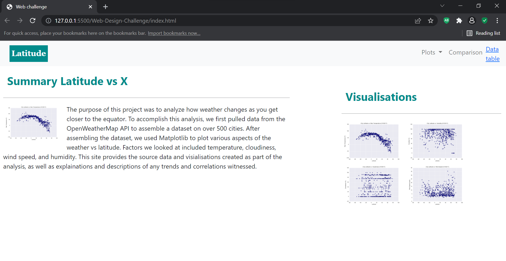
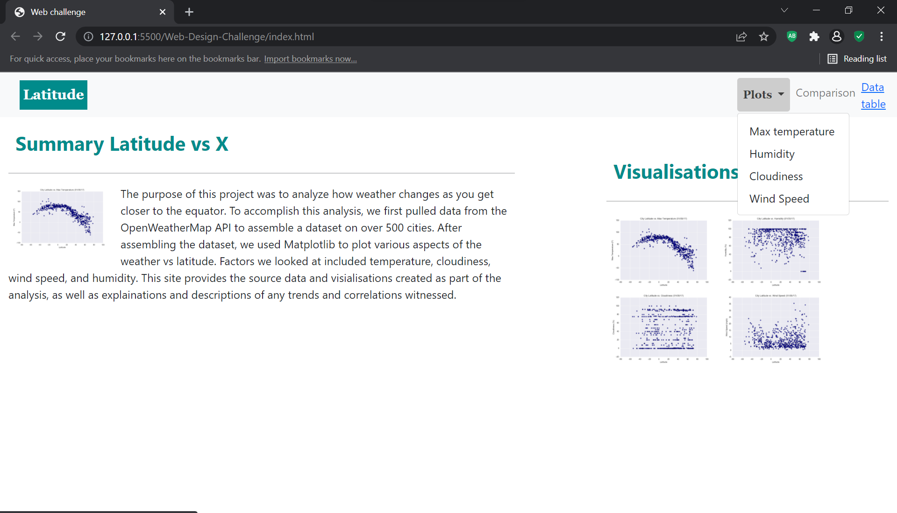
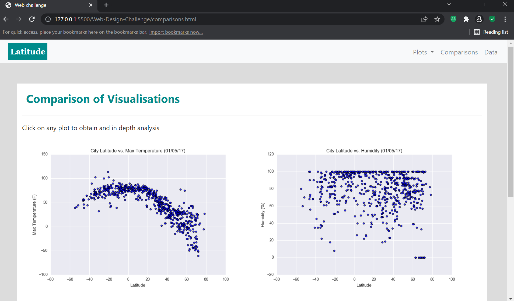
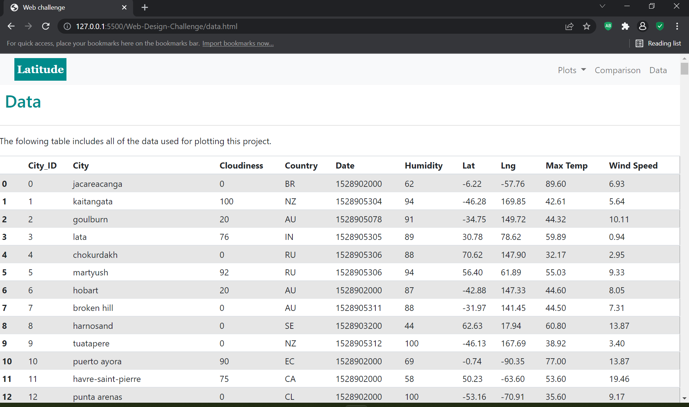

# Web-Design-Challenge

Dashboard (Latitude)

Data is more powerful when we share it with others! HTML and CSS is to create a weather dashboard.

Specifically, we'll be plotting [weather data](Resources/cities.csv)

We have created a Latitude visualization dashboard website using html, css, media queries and bootstrap. This project has been deployed to Github Pages. This site contains 7 induvidual pages. Index.html is the landing page which also contains an explaination of the project. The main code can be found at [index.html](./index.html) Each page has:

    1. a navigation menu which alows a user to return to the landing page. 
    2. a dropdown menu called "Plots" providing a link to each individual visualisation page:
              Maximum Temperature [visual1.html](./visual1.html)
              Humidity [visual2.html](./visual2.html)
              Cloudiness [visual3.html](./visual3.html)
              Wind Speed [visual4.html](./visual4.html)
    3. "Comparisons" which links to the comparisons page: [comparisons.html](./comparisons.html)
    4. "Data" which links to the data page: [data.html](./data.html)

I have utilsed Bootstrap for the navbar header on every page, and a Bootstrap grid for responsiveness to the visualisations and data pages. I have used CSS media query for responsiveness in the background and navigation bar.

I have checked that the website works at all widths/sizes. 